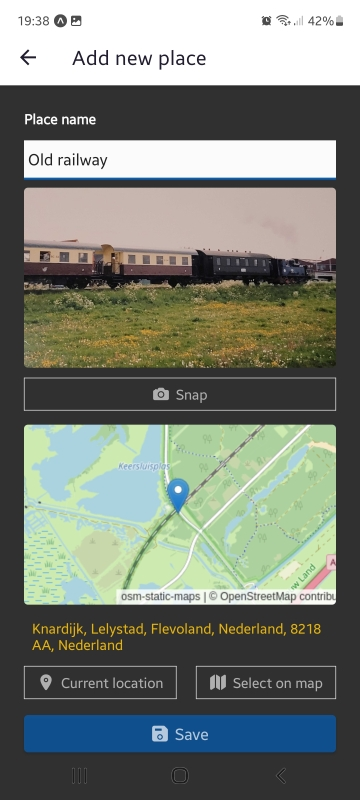
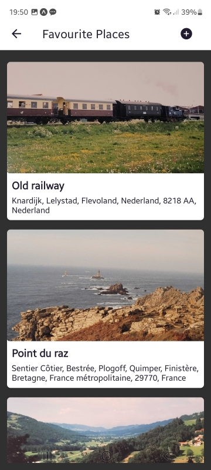
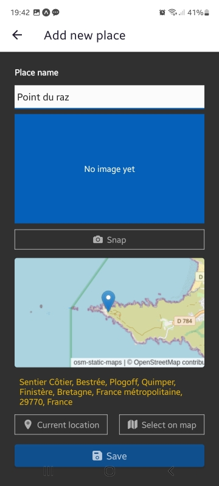
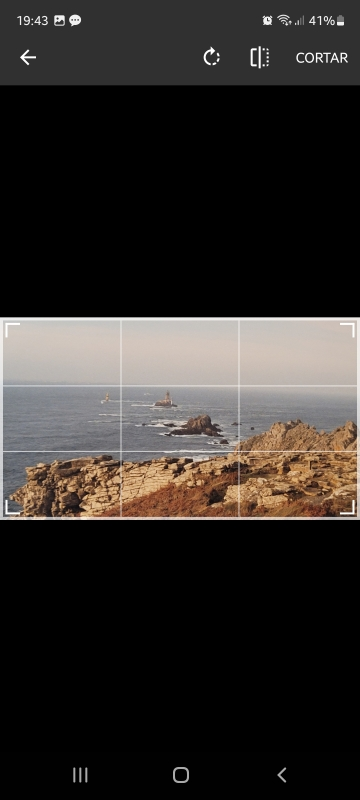
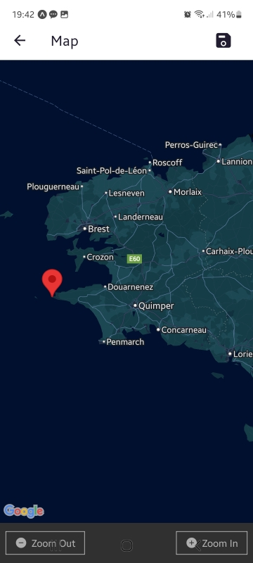

# Favorite Places

The App is a collection management of photos and places, final project of a
[React Native](https://reactnative.dev/) training course from
[Udemy](https://www.udemy.com/).

The user can take images with the device camera, select its location through
Google maps, and add some notes to it. All favorite places are kept in
the device storage.



Although most of the project ideas and features come from the course, I've
contributed with:

- A 100% TypeScript implementation
- Featuring [OpenStreetMap](https://www.openstreetmap.org/) imaginery (using [Julián Perelli's 'osm-static-map' service](https://github.com/jperelli/osm-static-maps))
- Camera access through [Expo Image Picker](https://docs.expo.dev/versions/latest/sdk/imagepicker/)

## Build and run

This is a [React Native](https://reactnative.dev/) app; you will need:

- A [Node.js](https://nodejs.org/en) environment
- Optional: An Android/iPhone emulator
- `osm-static-maps` service running

For a local test with the Expo app, you can install the dependencies, run
the project and take a photo of the exposed QR from your device.

```sh
# Install dependencies
$ npm install

# Start the developer server
$ npm run start
```

To start the OpenStreet Maps, a stand-alone server is required; you can
follow [osm-static-maps](https://github.com/jperelli/osm-static-maps)
instructions on the GitHub README file.

## Usage

The main screen lists the favorite places (first time would be empty):



The user can add a new place clicking on the "plus" button. Each place
features a name or comment, a picture and a GPS position that can be
get from the device's location or selecting on a map screen:



The `Snap` button gives access to the camera to take the place picture:



The `Select on map` button shows a live Google map screen where the place
can be selected:



Once saved, the user can go back to any favorite place by clicking in its
card on the list.

## Work in progress

The project is still in development, although it can be useful for
learning React Native, specially on a pure TypeScript build.

### TO-DO

- UI review (pretty simple to be honest)
- Add picking the image from the device gallery
- Allow more information on the place (tags, more pictures)
- Add sharing places (it would need a backend service)

## License

Source code under the [MIT License](https://mit-license.org/) terms.

See the [LICENSE](./LICENSE) file for the complete text.

